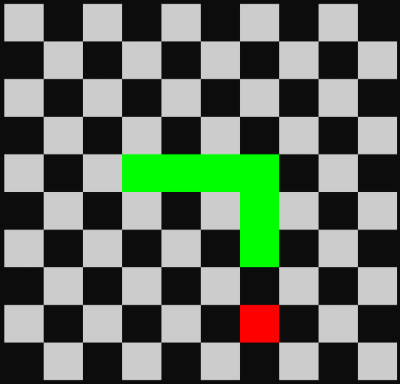

# Snake TUI

Classic snake using [FTXUI](https://github.com/ArthurSonzogni/FTXUI) library.



## Requirements

- C++20 compatible compiler.
- CMake v3.15 or higher.

## Usage

```shell
cmake -S . -B build
cmake --build build
./build/snake_tui
```
